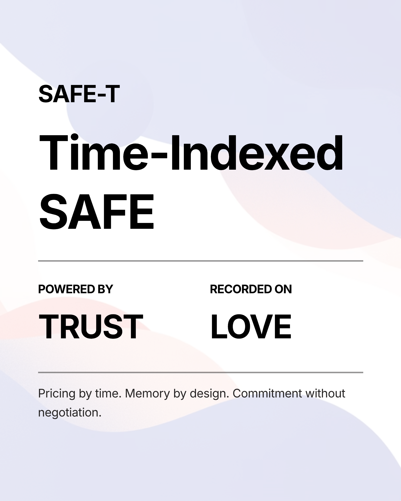

# SAFE-T: Time-Indexed SAFE

**Powered by TRUST | Recorded on LOVE**

---

## The One-Liner

**"We raise on a SAFE-T — a Time-Indexed SAFE powered by TRUST and recorded on LOVE."**

---

## What It Means

### SAFE-T
Standard SAFE with deterministic, time-indexed pricing. No negotiation. No side deals.

### TRUST
The pricing engine. Calculates valuation based on time and commitment size. All formulas public.

### LOVE
Ledger of Verifiable Events. Records all commitments, timestamps, and terms. Permanent memory.

---

## How It Works

```
1. Investor presses YesPen
   ↓
2. TRUST computes terms (time + size)
   ↓
3. LOVE records commitment
   ↓
4. 7-day TTL to wire
   ↓
5. Wire received → Confirmed
   Wire not received → Expired, back to queue
```

**Formulaic. Transparent. Permanent.**

---

## Pricing Formula

**Effective Valuation = Base V(t) × (1 - Size Discount) × (1 - Temporal Discount)**

- **Base V(t):** Decays 2% daily from starting cap
- **Size Discount:** 0-20% based on commitment ($5k-$250k+)
- **Temporal Discount:** 0-10% based on timing (Day 1-3 = 10%, Day 22+ = 0%)

**Example:**
- Day 2, $100k → Effective cap $3.67M → 2.72% equity
- Day 20, $10k → Effective cap $3.40M → 0.29% equity

**Early + Large = Better Terms**

---

## Key Features

✅ **Deterministic** — Formulas are public, non-negotiable  
✅ **Time-Indexed** — Earlier commitments get better terms  
✅ **Size-Rewarded** — Larger commitments get discounts  
✅ **TTL-Enforced** — 7 days to wire or lose spot  
✅ **Transparent** — All commitments recorded on LOVE  
✅ **Fair** — No side deals, no exceptions  

---

## Mental Model

You're not being "sold."

You're being offered:

**A deterministic entrance ramp into a company.**

Your position is:

- timestamped
- priced
- ranked
- archived

Instead of vibes.

---

## VC Translation

**"Is this crypto?"**  
No. LOVE is our ledger. SAFE is legal. TRUST is our pricing model.

**"Why does valuation move?"**  
Because information spreads. We refuse to pretend it doesn't.

**"Why is cap lower later?"**  
Early conviction is rare. Rare things are priced accordingly.

---




